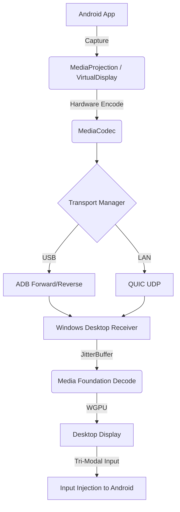

# AndroidDEX

A production-ready, low-latency Android desktop experience bridging Android devices to Windows hosts via USB and LAN.

## Architecture



## System Requirements
- **Android**: API 31+ (Android 12+)
- **Windows**: Windows 11
- **Android SDK**: API 34 Compile SDK
- **Rust**: Stable (1.75+)

## Setup & Execution

### Build Requirements
Ensure you have Android Studio installed and Rust `cargo` in your PATH. 
Run the build script to compile everything:
```bash
./build_all.bat
```

### USB Mode Setup
1. Enable **USB Debugging** in Android Developer Options.
2. Connect your device via USB.
3. The AndroidDEX app automatically runs `adb reverse` / `adb forward` via the `androiddex-discovery` module to bypass local IP requirements.

### LAN Mode Setup
1. Ensure both devices are on the same subnet.
2. AndroidDEX uses mDNS to broadcast its availability. The Windows receiver will automatically connect over the QUIC transport.

## Benchmarking Workflow
AndroidDEX operates on a strict Performance Budget:
- `EncodeLatency <= 10ms`
- `DecodeLatency <= 10ms`

To run an objective optimization loop:
1. Open the Android App and run `LiveValidator.executeLiveValidationSequence()` instead of the main UI.
2. Check the JSON output emitted by the `DiagnosticsApi`.
3. Compare the current metrics against your baseline JSON using `BenchmarkComparison.compare()`.

## Troubleshooting
- **Input does nothing on Android**: Input is dispatched into the desktop shell's own Compose view tree, so no permission is required. Confirm the host is actually streaming (frames are flowing) and that the receiver window has focus.
- **Windows shows black screen**: Check the `cargo run` logs. MediaFoundation requires H264/HEVC hardware decoders to be active on the host GPU.
- **High Latency**: Switch the `PerformancePreset` in `Config.kt` to `LOW_LATENCY` and ensure you are using USB mode.
