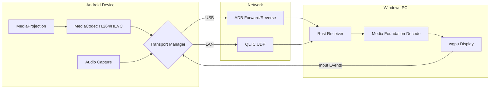

# AndroidDEX-V2 — Project Overview

## Overview

**AndroidDEX** is a production-grade, low-latency **Android Desktop Experience** system that turns an Android phone into a full desktop workstation by streaming its display to a Windows PC. Think of it as an open-source **Samsung DeX** alternative — the Android device acts as the compute engine while the Windows machine serves as the display, keyboard, and mouse.

The system captures the Android screen via `MediaProjection` / `VirtualDisplay`, hardware-encodes it with `MediaCodec` (H.264/HEVC), and streams the encoded frames over either **USB (ADB forward/reverse)** or **LAN (QUIC/UDP)** to a native Windows receiver that decodes with **Media Foundation** and renders with **wgpu**. Input (mouse, keyboard, touch) flows back from the desktop receiver to the Android device.

---

## Use Cases

| Use Case | Description |
|---|---|
| **Phone-as-PC** | Plug your Android phone into any monitor/keyboard/mouse setup and get a full desktop. No laptop required. |
| **Remote Desktop** | Stream your phone's screen to a Windows PC over LAN with sub-20ms latency for real-time interaction. |
| **Enterprise Zero Client** | Deploy Android phones as thin-client terminals managed via the built-in **MDM Console** with device policies, audit logs, and clipboard/file-transfer controls. |
| **Desktop Shell on Android** | The app renders a full windowed desktop environment (taskbar, app launcher, windowed apps like Browser, Files, Settings) on the Android's secondary display. |
| **Cross-device Input** | Use a Windows keyboard and mouse to control your Android device — including a custom IME for text input and an accessibility service for back/home/recents navigation. |
| **Audio Streaming** | Capture device audio and stream it alongside video to the desktop receiver. |
| **Developer Tooling** | Built-in diagnostics, encoder stats, and benchmark tools for latency optimization (`EncodeLatency ≤ 10ms`, `DecodeLatency ≤ 10ms`). |

---

## Tech Stack

### Android Host App — [`android-host/`](file:///c:/Users/Asus/Documents/GitHub/AndriodDEX-V2/android-host)

| Technology | Purpose |
|---|---|
| **Kotlin** | Primary language for all Android code |
| **Jetpack Compose + Material 3** | Desktop shell UI: [DesktopShell.kt](file:///c:/Users/Asus/Documents/GitHub/AndriodDEX-V2/android-host/app/src/main/java/com/example/androidhost/DesktopShell.kt), [Taskbar.kt](file:///c:/Users/Asus/Documents/GitHub/AndriodDEX-V2/android-host/app/src/main/java/com/example/androidhost/ui/components/Taskbar.kt), [WindowChrome.kt](file:///c:/Users/Asus/Documents/GitHub/AndriodDEX-V2/android-host/app/src/main/java/com/example/androidhost/ui/components/WindowChrome.kt), [AppLauncher.kt](file:///c:/Users/Asus/Documents/GitHub/AndriodDEX-V2/android-host/app/src/main/java/com/example/androidhost/ui/components/AppLauncher.kt) |
| **MediaProjection + VirtualDisplay** | Screen capture via [DisplayService.kt](file:///c:/Users/Asus/Documents/GitHub/AndriodDEX-V2/android-host/app/src/main/java/com/example/androidhost/service/DisplayService.kt) |
| **MediaCodec** | Hardware H.264/HEVC encoding via [ScreenEncoder.kt](file:///c:/Users/Asus/Documents/GitHub/AndriodDEX-V2/android-host/app/src/main/java/com/example/androidhost/video/ScreenEncoder.kt) |
| **QUIC (Rust via JNI)** | LAN transport via embedded Rust QUIC server in [`android-host/rust_quic_server/`](file:///c:/Users/Asus/Documents/GitHub/AndriodDEX-V2/android-host/rust_quic_server) |
| **AccessibilityService** | [DesktopAccessibilityService.kt](file:///c:/Users/Asus/Documents/GitHub/AndriodDEX-V2/android-host/app/src/main/java/com/example/androidhost/service/DesktopAccessibilityService.kt) — enables back/home/recents from the desktop |
| **Custom IME** | [AndroidDexIME.kt](file:///c:/Users/Asus/Documents/GitHub/AndriodDEX-V2/android-host/app/src/main/java/com/example/androidhost/service/AndroidDexIME.kt) — routes keyboard input from the Windows receiver |
| **Audio Capture** | [AudioCaptureService.kt](file:///c:/Users/Asus/Documents/GitHub/AndriodDEX-V2/android-host/app/src/main/java/com/example/androidhost/service/AudioCaptureService.kt) — captures and streams device audio |
| **Gradle (Kotlin DSL)** | Build system (Gradle 8.7+, compile SDK 34, min API 31) |

### Desktop Apps (in-shell)

Built-in windowed apps rendered inside the desktop shell on Android:

| App | File |
|---|---|
| Browser | [BrowserApp.kt](file:///c:/Users/Asus/Documents/GitHub/AndriodDEX-V2/android-host/app/src/main/java/com/example/androidhost/ui/apps/BrowserApp.kt) |
| Files | [FilesApp.kt](file:///c:/Users/Asus/Documents/GitHub/AndriodDEX-V2/android-host/app/src/main/java/com/example/androidhost/ui/apps/FilesApp.kt) |
| Settings | [SettingsApp.kt](file:///c:/Users/Asus/Documents/GitHub/AndriodDEX-V2/android-host/app/src/main/java/com/example/androidhost/ui/apps/SettingsApp.kt) |

---

### Windows Receiver — [`rust-receiver/`](file:///c:/Users/Asus/Documents/GitHub/AndriodDEX-V2/rust-receiver)

A Rust workspace with modular crates:

| Crate | Purpose |
|---|---|
| `zc-core` | Main receiver binary and orchestration |
| `zc-video` | Media Foundation hardware decoding + wgpu rendering |
| `zc-network` | Network transport (QUIC client, ADB bridge) |
| `zc-protocol` | Wire protocol and frame parsing |
| `zc-input` | Mouse/keyboard capture and event serialization |
| `zc-security` | TLS/QUIC certificate and encryption management |
| `zc-audio` | Audio playback on the desktop side |

**Key Rust dependencies**: `tokio`, `quinn` (QUIC), `wgpu` (GPU rendering), `prost` (protobuf), `windows` (Win32 Media Foundation + Direct3D 11)

---

### AndroidDEX Core Library — [`AndroidDEX-Core/`](file:///c:/Users/Asus/Documents/GitHub/AndriodDEX-V2/AndroidDEX-Core)

A hybrid Rust + Gradle workspace providing shared core modules:

| Module | Purpose |
|---|---|
| `androiddex-video` | Video receiver pipeline |
| `androiddex-audio` | Audio pipeline |
| `androiddex-network` | Network abstraction |
| `androiddex-input` | Input protocol |
| `androiddex-security` | Certificate/encryption |
| `androiddex-discovery` | mDNS / ADB device discovery |
| `androiddex-session` | Session management |
| `androiddex-diagnostics` | Latency benchmarking and diagnostics |
| `shared-protocol` | Protobuf wire protocol shared between Android and desktop |

---

### MDM Console — [`mdm-console/`](file:///c:/Users/Asus/Documents/GitHub/AndriodDEX-V2/mdm-console)

Enterprise management dashboard:

| Technology | Purpose |
|---|---|
| **Next.js 16** | React server components framework |
| **React 19** | UI library |
| **TypeScript** | Type-safe frontend/backend code |
| **Tailwind CSS 4** | Utility-first styling |
| **better-sqlite3** | Local SQLite DB for device/policy/audit data |
| **Puppeteer** | Automated screenshot generation for store listings |

**Database tables**: `devices`, `policies`, `audit_logs` (defined in [schema.sql](file:///c:/Users/Asus/Documents/GitHub/AndriodDEX-V2/mdm-console/schema.sql))

---

### Shared / Infrastructure

| Component | Technology |
|---|---|
| **Protocol Buffers** | Wire format for audio packets ([audio.proto](file:///c:/Users/Asus/Documents/GitHub/AndriodDEX-V2/proto/audio.proto)) and other streams |
| **protoc** | Protobuf compiler (v25+) |
| **cargo-ndk** | Cross-compiles Rust to Android NDK targets |
| **ADB** | USB bridge for forwarding/reversing TCP ports |
| **Python 3** | Test utilities and mock servers ([input_test_sender.py](file:///c:/Users/Asus/Documents/GitHub/AndriodDEX-V2/input_test_sender.py), [receiver.py](file:///c:/Users/Asus/Documents/GitHub/AndriodDEX-V2/receiver.py)) |

---

### System Requirements

| Component | Minimum |
|---|---|
| Android | API 31+ (Android 12+) |
| Windows | Windows 11 |
| Rust | 1.75+ stable |
| Gradle | 8.7+ |
| Android SDK | Compile SDK 34 |
