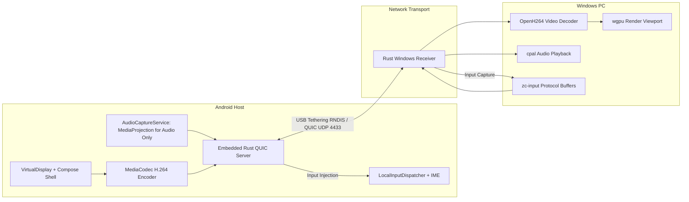

# AndroidDEX-V2 — Architecture & Technical Overview

## Overview

**AndroidDEX** is a low-latency **Android Desktop Experience** system that streams an Android desktop workstation to a Windows PC over USB tethering. The Android device functions as the compute host while the Windows machine serves as the display, keyboard, and mouse interface.

The system creates an internal `VirtualDisplay` on Android, renders a Jetpack Compose desktop shell onto its surface, hardware-encodes the composited video stream with `MediaCodec` (H.264), captures system audio via `AudioCaptureService` using `MediaProjection` (for audio only), and streams video and audio over a TLS-authenticated QUIC connection (UDP port 4433) across the USB tethering (RNDIS/NDIS) subnet. A native Rust Windows receiver decodes the video using OpenH264, renders frames using `wgpu`, plays audio using `cpal`, and captures mouse/keyboard input to stream back to Android.

---

## Architecture Components

### 1. Android Host Application — [`android-host/`](file:///c:/Users/Asus/Documents/GitHub/AndriodDEX-V2/android-host)

| Component | Technology | Primary Source Files |
|---|---|---|
| **Desktop Shell** | Jetpack Compose + Material 3 | [DesktopShell.kt](file:///c:/Users/Asus/Documents/GitHub/AndriodDEX-V2/android-host/app/src/main/java/com/example/androidhost/DesktopShell.kt), [Taskbar.kt](file:///c:/Users/Asus/Documents/GitHub/AndriodDEX-V2/android-host/app/src/main/java/com/example/androidhost/ui/components/Taskbar.kt), [WindowChrome.kt](file:///c:/Users/Asus/Documents/GitHub/AndriodDEX-V2/android-host/app/src/main/java/com/example/androidhost/ui/components/WindowChrome.kt), [AppLauncher.kt](file:///c:/Users/Asus/Documents/GitHub/AndriodDEX-V2/android-host/app/src/main/java/com/example/androidhost/ui/components/AppLauncher.kt) |
| **VirtualDisplay & Presentation** | Android DisplayManager & Presentation | [DisplayService.kt](file:///c:/Users/Asus/Documents/GitHub/AndriodDEX-V2/android-host/app/src/main/java/com/example/androidhost/service/DisplayService.kt), [DesktopPresentation.kt](file:///c:/Users/Asus/Documents/GitHub/AndriodDEX-V2/android-host/app/src/main/java/com/example/androidhost/service/DesktopPresentation.kt) |
| **Video Encoding** | Hardware `MediaCodec` (H.264) | [ScreenEncoder.kt](file:///c:/Users/Asus/Documents/GitHub/AndriodDEX-V2/android-host/app/src/main/java/com/example/androidhost/video/ScreenEncoder.kt) |
| **Audio Capture** | `AudioRecord` + `MediaProjection` (audio capture only) | [AudioCaptureService.kt](file:///c:/Users/Asus/Documents/GitHub/AndriodDEX-V2/android-host/app/src/main/java/com/example/androidhost/service/AudioCaptureService.kt) |
| **QUIC Server (Native)** | Rust `quinn` / `tokio` via JNI cdylib | [lib.rs](file:///c:/Users/Asus/Documents/GitHub/AndriodDEX-V2/android-host/rust_quic_server/src/lib.rs), [QuicServer.kt](file:///c:/Users/Asus/Documents/GitHub/AndriodDEX-V2/android-host/app/src/main/java/com/example/androidhost/quic/QuicServer.kt) |
| **Input Dispatching** | JNI blocking input queue + MotionEvent/KeyEvent injection | [InputManager.kt](file:///c:/Users/Asus/Documents/GitHub/AndriodDEX-V2/android-host/app/src/main/java/com/example/androidhost/service/InputManager.kt), [LocalInputDispatcher.kt](file:///c:/Users/Asus/Documents/GitHub/AndriodDEX-V2/android-host/app/src/main/java/com/example/androidhost/input/LocalInputDispatcher.kt) |
| **System Navigation & IME** | AccessibilityService & Custom IME | [DesktopAccessibilityService.kt](file:///c:/Users/Asus/Documents/GitHub/AndriodDEX-V2/android-host/app/src/main/java/com/example/androidhost/service/DesktopAccessibilityService.kt), [AndroidDexIME.kt](file:///c:/Users/Asus/Documents/GitHub/AndriodDEX-V2/android-host/app/src/main/java/com/example/androidhost/service/AndroidDexIME.kt) |
| **Native Compute Service** | On-device Linux / Code-Server execution | [NativeComputeService.kt](file:///c:/Users/Asus/Documents/GitHub/AndriodDEX-V2/android-host/app/src/main/java/com/example/androidhost/service/NativeComputeService.kt), [CodeServerWindow.kt](file:///c:/Users/Asus/Documents/GitHub/AndriodDEX-V2/android-host/app/src/main/java/com/example/androidhost/ui/linux/CodeServerWindow.kt) |

### Built-in Desktop Shell Applications

- **Browser**: [BrowserApp.kt](file:///c:/Users/Asus/Documents/GitHub/AndriodDEX-V2/android-host/app/src/main/java/com/example/androidhost/ui/apps/BrowserApp.kt) — Multi-tab Android WebView browser.
- **Files**: [FilesApp.kt](file:///c:/Users/Asus/Documents/GitHub/AndriodDEX-V2/android-host/app/src/main/java/com/example/androidhost/ui/apps/FilesApp.kt) — Storage and filesystem navigation.
- **Settings**: [SettingsApp.kt](file:///c:/Users/Asus/Documents/GitHub/AndriodDEX-V2/android-host/app/src/main/java/com/example/androidhost/ui/apps/SettingsApp.kt) — Resolution, bitrate, and display configuration.
- **Terminal**: [TerminalWindow.kt](file:///c:/Users/Asus/Documents/GitHub/AndriodDEX-V2/android-host/app/src/main/java/com/example/androidhost/ui/linux/TerminalWindow.kt) — Local Android shell interface.

---

### 2. Windows Receiver Workspace — [`rust-receiver/`](file:///c:/Users/Asus/Documents/GitHub/AndriodDEX-V2/rust-receiver)

| Crate | Purpose | Key Dependencies |
|---|---|---|
| `zc-core` | Application entry point, window management, and event loop orchestration | `winit`, `egui`, `pollster` |
| `zc-video` | H.264 video decoding and GPU texture presentation | `openh264`, `wgpu` |
| `zc-network` | RNDIS subnet discovery and QUIC client connection management | `quinn`, `rustls`, `ipconfig` |
| `zc-protocol` | Protocol Buffers message serialization and frame framing | `prost`, `prost-build` |
| `zc-input` | Windows keyboard/mouse event capture and input packet generation | `winit`, `prost` |
| `zc-security` | Cryptographic pairing, HKDF key derivation, and TLS cert validation | `ring`, `x25519-dalek`, `rcgen` |
| `zc-audio` | Audio stream buffer management and real-time playback | `cpal`, `rubato`, `crossbeam-queue` |

---

## Wire Protocol & Security Model

- **Pairing (ALPN `androiddex-pairing`)**: Ephemeral X25519 key exchange authenticated with a 6-digit user-verified PIN using HKDF-SHA256. The resulting Pre-Shared Key (PSK) is persisted locally in app private storage (`pairing.psk`).
- **Streaming (ALPN `androiddex`)**: Resuming connections authenticate via SHA256 auth tokens derived from the stored PSK.
- **Framing**:
  - `0x01`: Video packet (`HybridFrame` containing H.264 NALUs).
  - `0x02`: Audio packet (`AudioPacket` containing 16-bit PCM samples).
  - Input stream: Unidirectional stream transporting length-prefixed `InputEvent` protobuf messages.

---

## System Requirements

| Component | Minimum Specification |
|---|---|
| Android Host | Android 10+ (minSdk 29, compileSdk 36, targetSdk 34) |
| Windows Client | Windows 10 / 11 (64-bit) |
| Toolchains | Rust 1.85+ stable (required for edition 2024), Android NDK 26.1.10909125, JDK 17, Gradle 9.1.0 (supplied by wrapper) |

---

## Not Implemented

The following features are not currently part of the active codebase:
- Automated mDNS discovery or ADB reverse / forward transport routing.
- Generic wireless LAN streaming (connection is currently established exclusively via USB tethering subnet scanning).
- MediaProjection-based display mirroring (the system renders its own Compose desktop into a VirtualDisplay; MediaProjection is utilized solely by AudioCaptureService for audio capture).
- Enterprise MDM remote policy enforcement and device enrollment consoles.
- Configurable JitterBuffer, TransportManager, PerformancePreset, or LiveValidator test sequences.
